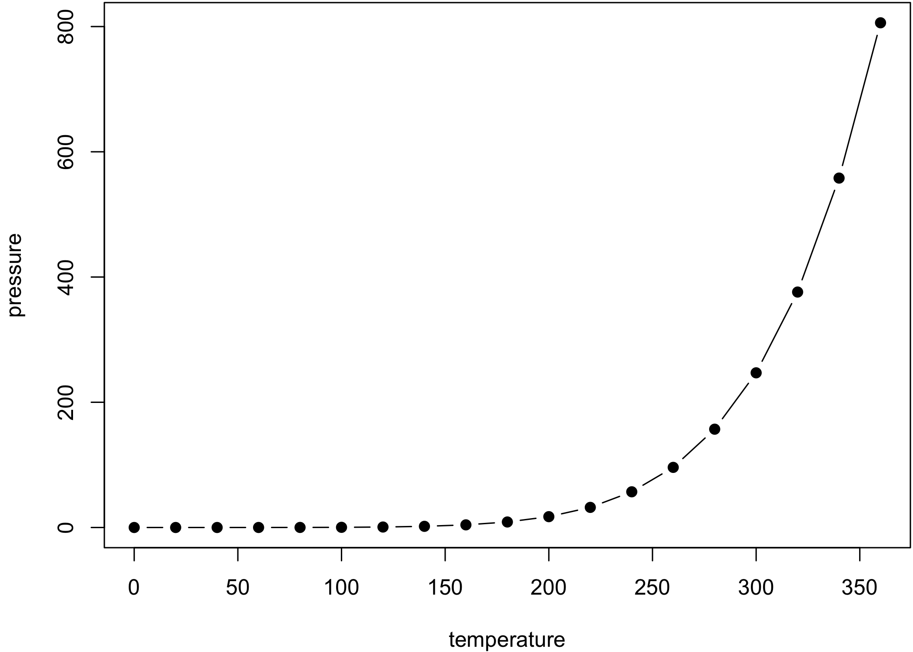

# TITLE
NAME  
`r format(Sys.time(), "%B %d, %Y")`  

# Description

This set of scripts help convert the output of `Rmd` or `md` files to `docx` files. It is done by creating a clean `html` file, then opening, converting, and saving the `html` to `docx` using [Applescript and Microsoft Word](https://www.dropbox.com/s/4bwwsgod27w1fjo/word-2004-applescript-reference.pdf?dl=0).

The workhorse script is a `makefile`. Just change the variables to convert any `Rmd` to `docx`. However, only clean (not standalone) `html` files will fully convert. There are some caveats (outlined below) if you want to keep a standalone `html` file.

In this repo, the `makefile` converts `example.Rmd` to `example.docx`.

## The output files

- `example.html`
- `example.md`
- `example.docx`

## The main support file

- `html2docx.sh`

The `makefile` automatically downloads the `html2docx.sh` conversion script using `wget` if it's missing. (Requires unix command-line tool `wget` to download if missing.)

## Optional support files

- `chicago-author-date.csl`
- `bibliography.bib`

These files are listed to show that folks can cite references (useful for academics). To learn more about these RMarkdown `yaml` options, see this [RStudio post](http://rmarkdown.rstudio.com/authoring_bibliographies_and_citations.html).

# Requirements

1. Microsoft Word for Mac in your Applications folder. This has been built and testing using Microsfot Word for Mac, Version `15.20`.
2. `R` with packages `rmarkdown` and `knitr`.
3. An understanding of how to use GNU Make and terminal commands.

# How to Use

There are two options for going from `Rmd` to `docx`. The first `make` option is `all` and the second is `alt`. But before anything, make sure the `makefile` variables are set up accordingly. Simply change the `RMD_NAME` variable (and optional `CSL_FILE` and `BIBLIO_FILE` variables if you use the `alt` option) to suite your needs:

```
RMD_NAME = example.Rmd
CSL_FILE = $(CURDIR)/chicago-author-date.csl
BIBLIO_FILE = $(CURDIR)/bibliography.bib
```

In this case, the `Rmd` file of interest is `example.Rmd`. We use the GNU `make` variable for current working directory, `$(CURDIR)`, to source the csl and bib files. Again, the optional variable are only really necessary if you need a standalone `html` file and use the `alt` option.


## Option 1: `all`

Simply run

```
make all
```

Although one can knit an `html` file from a `Rmd` file---letting knitr run the `pandoc` step---there is a caveat.

> output options `self_contained` **must** be `FALSE`. Otherwise, Microsoft Word will crash during the `html` to `docx` conversion. Keep in mind that this is the default option for `rmarkdown`. But I force it to be true in the `makefile`.

Also, it doesn't matter if `keep_md: true`. I just prefer to have the `.md` regardless of what I'm doing. Basically, you want to make sure the final `html` file produce is as simple and clean as possible. The conversion script will do the rest.

## Option 2: `alt`

You cannot convert a self contained (aka standalone) `html` file to a `docx`. (At least I've found that it always crashes.) If you want the option to have a standalone `html` file, then then we use option `alt`.

Simply run

```
make alt
```

This will produce a clean (not self contained) `html`, create a `docx` file, then replace the clean `html` file with a standalone file.

It's a little hackish, but it allows you to create a `docx` AND keep a standalone `html` file.

# First Run, Word will ask for permission

When you first run the script, do not worry if Word asks for permissions. Once you give Word access to the folder and files, it should run just fine and without asking again every time after.

---
Here is some random stuff just to show you that the conversion script works.

# A random citation

Tidy data is important. See [@wickham_tidy_2014].

# Some Plots and Tables

I stole these from Yihui Xie.

Figures and tables with captions will be placed in `figure` and `table` environments, respectively.

<div class="figure" style="text-align: center">

<p class="caption">Here is a nice figure!</p>
</div>


Table: Here is a nice table!

 Sepal.Length   Sepal.Width   Petal.Length   Petal.Width  Species 
-------------  ------------  -------------  ------------  --------
          5.1           3.5            1.4           0.2  setosa  
          4.9           3.0            1.4           0.2  setosa  
          4.7           3.2            1.3           0.2  setosa  
          4.6           3.1            1.5           0.2  setosa  
          5.0           3.6            1.4           0.2  setosa  
          5.4           3.9            1.7           0.4  setosa  
          4.6           3.4            1.4           0.3  setosa  
          5.0           3.4            1.5           0.2  setosa  
          4.4           2.9            1.4           0.2  setosa  
          4.9           3.1            1.5           0.1  setosa  
          5.4           3.7            1.5           0.2  setosa  
          4.8           3.4            1.6           0.2  setosa  
          4.8           3.0            1.4           0.1  setosa  
          4.3           3.0            1.1           0.1  setosa  
          5.8           4.0            1.2           0.2  setosa  
          5.7           4.4            1.5           0.4  setosa  
          5.4           3.9            1.3           0.4  setosa  
          5.1           3.5            1.4           0.3  setosa  
          5.7           3.8            1.7           0.3  setosa  
          5.1           3.8            1.5           0.3  setosa  

# Shortcomings

## Footnotes

Footnotes, not matter what, go to the bottom of the page. Just how html files work.

# Thanks

A special thanks to [Andrew Heiss](http://github.com/andrewheiss), from whom I've learned almost all I know about makefiles and converting markdown files to docx files.


